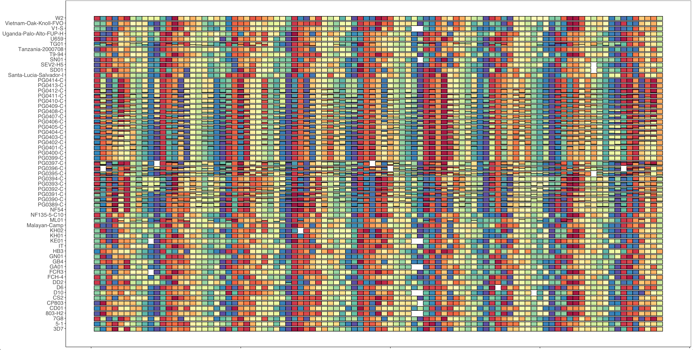
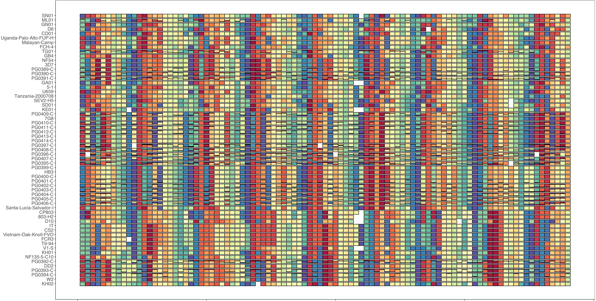
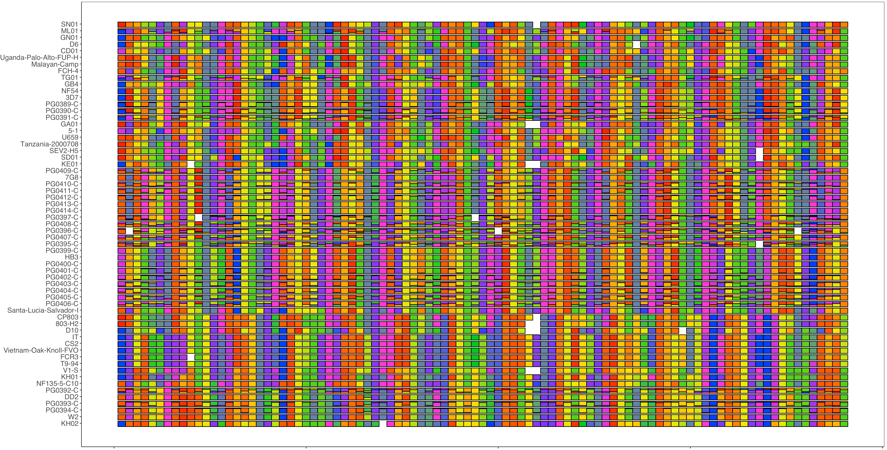

# Haplotype Rainbow

version v1.0.0

This is a collection of tools in R to create haplotype "rainbows" with a myriad input as opposed to SNP barcodes which only have binary input. 

# Install  

Install the most recent release using devtools  

```r
devtools::install_github('nickjhathaway/rainbowHaplotypes')
```
Or the developmental branch 

```r
devtools::install_github('nickjhathaway/rainbowHaplotypes@develop')
```

# Input 

The tools need a minimum of 4 columns 

1.  Sample name column
2.  A loci name column 
3.  A population id for the haplotype for that loci
4.  A within sample relative abundance of the haplotype


These tools were developed to work with [SeekDeep](https://github.com/bailey-lab/SeekDeep) data output and so it assumes the default for the columns above are as follows:


1.  **s_Sample** - Sample name column
2.  **p_name** - A loci name column 
3.  **h_popUID** - A population id for the haplotype for that loci
4.  **c_AveragedFrac** - A within sample relative abundance of the haplotype

But you can specify column names when using the functions 

## Prep
There are two main steps for creating the haplotypes, first is to process the input data to create new data table to create the figures from. The library relies heavily on the [tidyverse](https://www.tidyverse.org/) library.  

Below uses example data set from *Plasmodium falciparum* lab isolates and mixtures  
 
```r
library(rainbowHaplotypes)

# load example data 
data("pfisolateExample") 

#prep data 
pfIsosHeomeV1_prep = prepForRainbow(pfIsosHeomeV1)
 
#prep data when columns have other than default names 

pfIsosHeomeV1_otherName_prep = prepForRainbow(pfIsosHeomeV1_otherName,
                                              sampleCol = Sample, 
                                              targetCol = loci, 
                                              popUIDCol = ID, 
                                              relAbundCol = freq)

```

## Plotting  

Below creates a ggplot object from the prep data, this object can either be plotted or further manipulated as needed first  

```r
genRainbowHapPlotObj(pfIsosHeomeV1_prep)

genRainbowHapPlotObj(pfIsosHeomeV1_otherName_prep,
                                              sampleCol = Sample, 
                                              targetCol = loci, 
                                              popUIDCol = ID, 
                                              relAbundCol = freq) 

```

This creates a plot where with samples on the y-axis and targets/loci on the x-axis. The within sample frequencies will be taken into account and will adjust the bars accordingly. The colors have meaning in each color, e.g. the same color within a column is the same haplotype, but colors across columns don't relate to each other. 

The package was developed so the colors denoting each major haplotype slightly in hue in each column/loci which ends up creating a repeating "rainbow" across (with default period of 11). 



### Manipulating plotting  

#### Sample Order 

By default the samples are sorted by default character sorting but you can manipulate the order of the samples by the change the order of the factor levels of the samples, for example if you want to change the order so that samples sharing similar haplotypes were next to each other


```r
# select just the major haplotypes and cluster based on the sharing between
pfIsosHeomeV1_prep_sp = pfIsosHeomeV1_prep %>% 
  group_by(s_Sample, p_name) %>% 
  filter(c_AveragedFrac == max(c_AveragedFrac)) %>% 
  mutate(marker = 1) %>% 
  group_by() %>% 
  select(h_popUID, marker, s_Sample) %>%   
  spread(h_popUID, marker, fill = 0)

pfIsosHeomeV1_prep_sp_mat = as.matrix(pfIsosHeomeV1_prep_sp[,2:ncol(pfIsosHeomeV1_prep_sp)])
rownames(pfIsosHeomeV1_prep_sp_mat) = pfIsosHeomeV1_prep_sp$s_Sample
pfIsosHeomeV1_prep_sp_dist = dist(pfIsosHeomeV1_prep_sp_mat)
pfIsosHeomeV1_prep_sp_dist_hclust = hclust(pfIsosHeomeV1_prep_sp_dist)

#rename the levels so they are in the order of the clustering 
pfIsosHeomeV1_prep = pfIsosHeomeV1_prep %>% 
  mutate(s_Sample = factor(s_Sample, levels = rownames(pfIsosHeomeV1_prep_sp_mat)[pfIsosHeomeV1_prep_sp_dist_hclust$order]))
genRainbowHapPlotObj(pfIsosHeomeV1_prep)

```



#### Custom Colors  
Instead of the using the default colors you can input your own color palette to use 

```r
genRainbowHapPlotObj(pfIsosHeomeV1_prep, colors = c("#F50300","#FF6E00","#FFEB01","#00CA1E","#0241FE","#FE00D4"))

```

