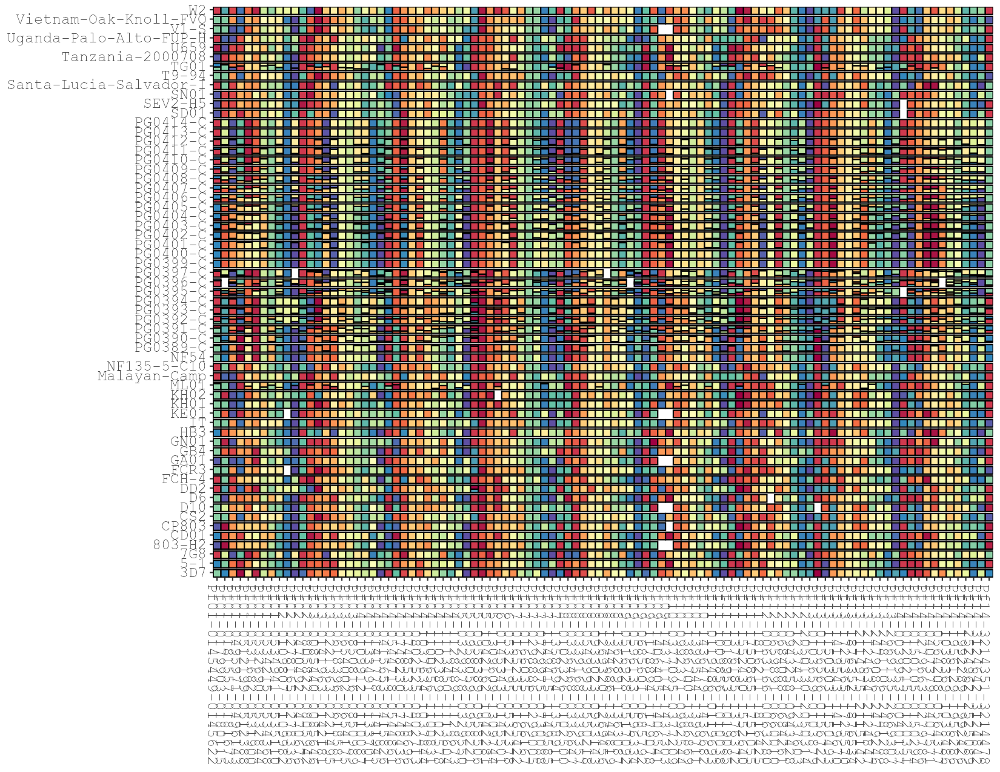
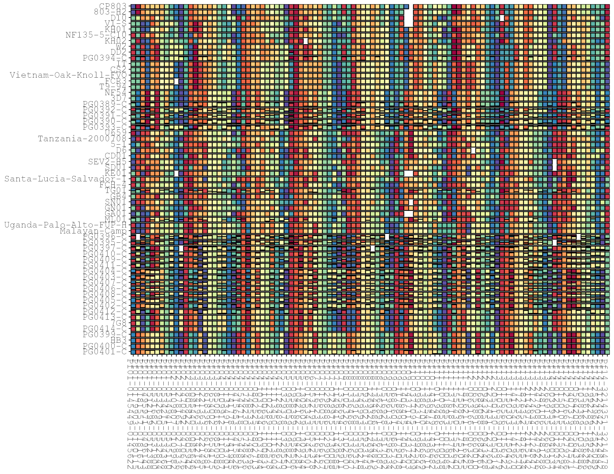
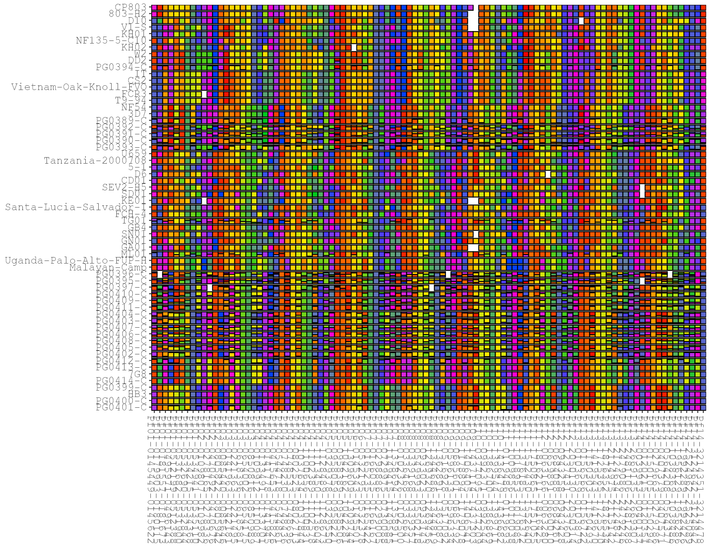

# Haplotype Rainbows

<!-- badges: start -->
[](https://github.com/nickjhathaway/HaplotypeRainbows/actions/workflows/R-CMD-check.yaml)
[](https://nickjhathaway.github.io/HaplotypeRainbows/)
[](https://lifecycle.r-lib.org/articles/stages.html#experimental)
[](https://www.gnu.org/licenses/gpl-3.0)
<!-- badges: end -->

version v2.0.0

A collection of tools in R to create haplotype "rainbows" from targeted amplicon
(microhaplotype) sequencing data. Unlike SNP barcodes, which are binary, these plots
handle arbitrary within-sample haplotype composition. Columns are targets, rows are
samples, and each cell shows the within-sample relative abundance of each haplotype,
coloured so that the dominant haplotype hue rotates across targets — producing the
characteristic "rainbow".

> **v2.0.0 is a breaking change.** The old standalone functions (`prepForRainbow`,
> `genRainbowHapPlotObj`, …) have been replaced by a single R6 class,
> `HaplotypeRainbow`, that carries your column mapping so you only set it once.
> Column defaults now follow the [PMO](https://plasmogenepi.github.io/PMO_Docs/)
> convention rather than SeekDeep.

# Documentation

📖 Full documentation, function reference, and a gallery of worked examples live on the
package website:

**<https://nickjhathaway.github.io/HaplotypeRainbows/>**

The [Articles](https://nickjhathaway.github.io/HaplotypeRainbows/articles/) cover
[getting started](https://nickjhathaway.github.io/HaplotypeRainbows/articles/getting-started.html),
[colours & plot styles](https://nickjhathaway.github.io/HaplotypeRainbows/articles/colours.html),
[sample & target metadata](https://nickjhathaway.github.io/HaplotypeRainbows/articles/metadata.html),
[clustering & splitting plots](https://nickjhathaway.github.io/HaplotypeRainbows/articles/clustering.html),
and [saving & interactivity](https://nickjhathaway.github.io/HaplotypeRainbows/articles/saving.html).

# Install

```r
# most recent release
devtools::install_github('nickjhathaway/HaplotypeRainbows')

# development branch
devtools::install_github('nickjhathaway/HaplotypeRainbows@develop')
```

# Input

The tools need a minimum of 4 columns:

1. Sample name
2. Target / locus name
3. A within-target haplotype identifier
4. A within-sample relative abundance (raw counts are fine — they are normalised
   internally)

The column defaults follow the **Portable Microhaplotype Object (PMO)** convention:

| Role                     | Default column        |
|--------------------------|-----------------------|
| Sample name              | `library_sample_name` |
| Target / locus name      | `target_name`         |
| Haplotype identifier     | `seq`                 |
| Relative counts          | `reads`               |

You can override any of these when constructing the object.

# Usage

Everything runs through the `HaplotypeRainbow` R6 class. Transforming methods
(`prep()`, `sort_by_clustering()`, `set_sample_order()`, `sort_alphabetical()`)
mutate the object and return it, so they can be chained; `plot()` returns a
`ggplot` object you can print, `ggsave()` or hand to `plotly::ggplotly()`.

```r
library(HaplotypeRainbows)

# load example data (uses the older SeekDeep column names)
data("pfisolateExample")

# construct with your column mapping (only needed once)
rb <- HaplotypeRainbow$new(
  pfIsosHeomeV1,
  sample_col    = "s_Sample",
  target_col    = "p_name",
  popuid_col    = "h_popUID",
  rel_abund_col = "c_AveragedFrac"
)

# prep + plot
rb$prep(sort = "population_rank")
rb$plot()
```

If your data already uses the PMO column names, no mapping is needed:

```r
rb <- HaplotypeRainbow$new(my_pmo_allele_table)   # or haplotype_rainbow(my_pmo_allele_table)
rb$prep()$plot()
```

The colours have meaning within each column (same colour = same haplotype for that
target), but not across columns. The dominant-haplotype hue steps across targets with a
period (default 11) to create the rainbow.



## Sorting samples

Order samples so that similar samples (by haplotype sharing) sit next to each other
using hierarchical clustering (ward.D2):

```r
rb$prep(sort = "population_rank")$sort_by_clustering()
rb$plot()
```



Other ordering options:

```r
rb$sort_by_clustering(by_major_allele = TRUE)   # cluster on the major allele only
rb$set_sample_order(c("3D7", "HB3", "..."))      # explicit order
rb$sort_alphabetical()                            # default
```

## Custom colours

Supply your own palette to `plot()`:

```r
rb$plot(colors = c("#F50300","#FF6E00","#FFEB01","#00CA1E","#0241FE","#FE00D4"))
```



## Haplotype ordering

`prep(sort = ...)` controls how haplotypes are ordered within each cell:

- `"population_rank"` — order haplotypes by population rank (default)
- `"within_sample_freq"` — order haplotypes by within-sample fraction

## Shade plots

Instead of a rotating rainbow, `prep_shade()` colours each target with shades of a
per-target base colour. `plot()` automatically uses the shade colours:

```r
rb$prep_shade(min_pop_size = 1)
rb$plot()
```

## Axis labels

Target names (x) and sample names (y) are shown by default; toggle either off (the plot
keeps tight margins with no leftover ticks):

```r
rb$plot(x_axis_labels = FALSE)                        # hide target names
rb$plot(x_axis_labels = FALSE, y_axis_labels = FALSE) # hide both (e.g. many samples)
```

# Notes

- Interactive tooltips: `plot()` carries the sample, target, haplotype and abundance
  values as extra aesthetics so `plotly::ggplotly()` shows them on hover.
- Migrating from v1.x: the class methods map onto the old functions
  (`prep()` → `prepForRainbow*`, `plot()` → `genRainbowHapPlotObj*`,
  `sort_by_clustering()` → `resort_prepped_samples_by_clustering`).
