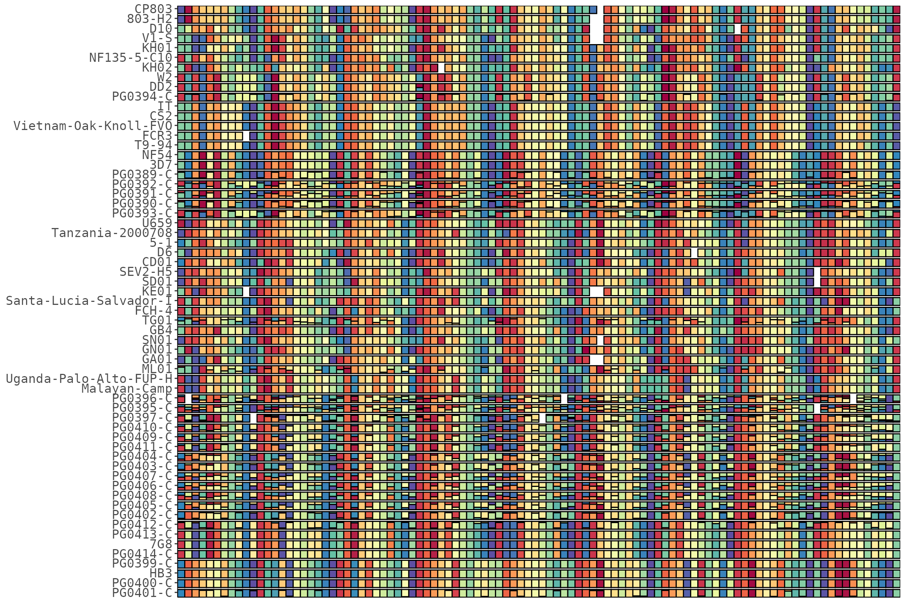
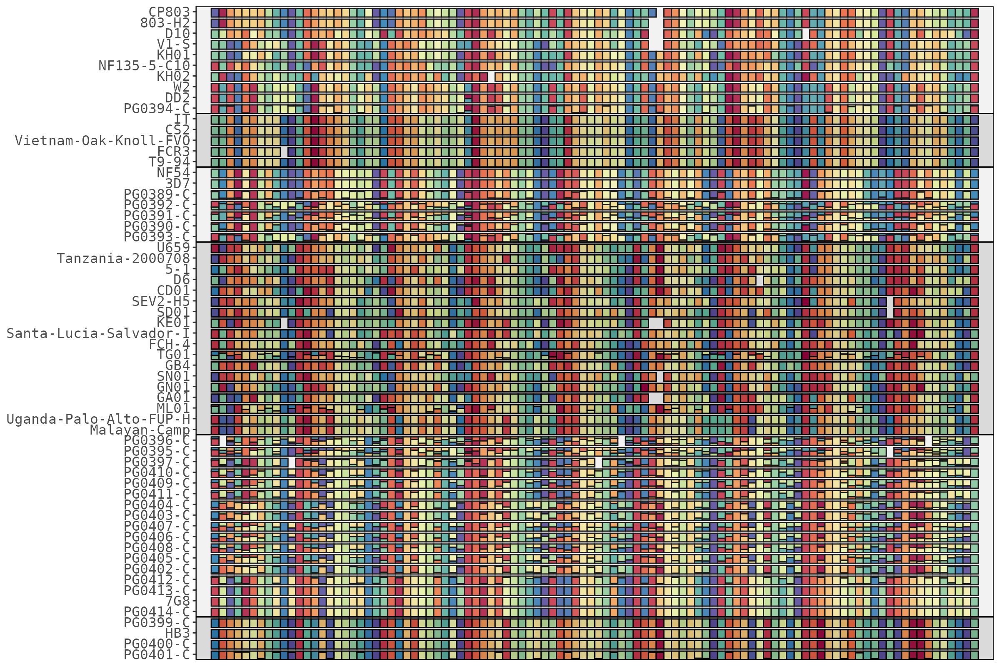
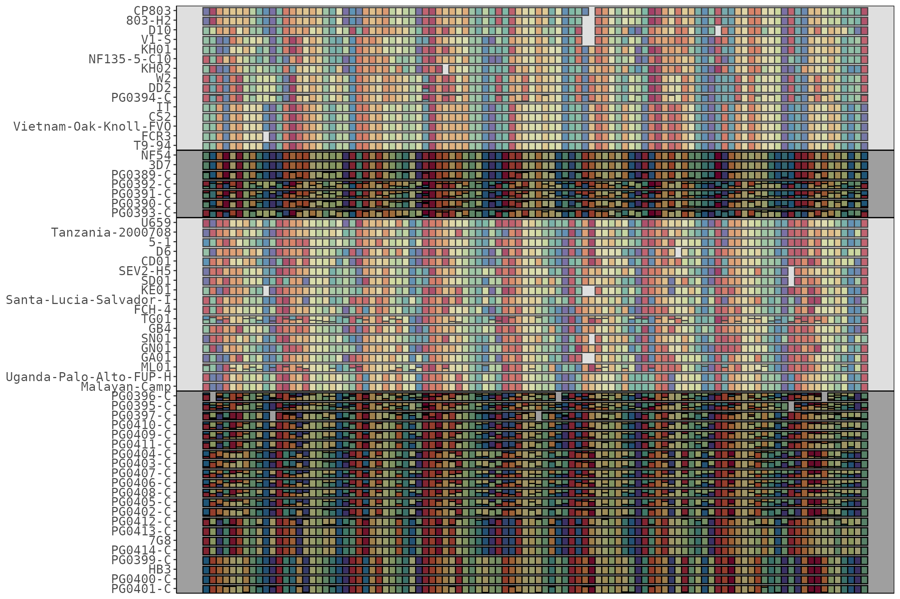
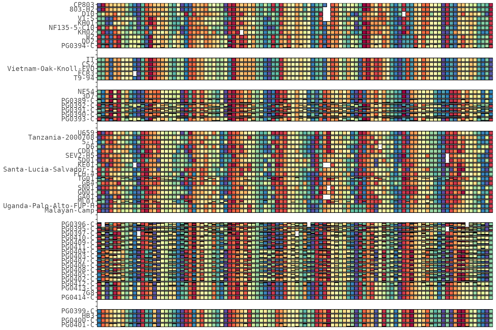
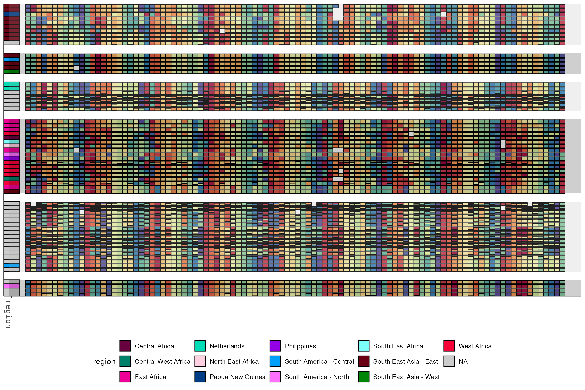

# Clustering & splitting plots

Cluster samples so similar ones sit together, pull the tree and group
assignments back out, and show or split the clusters — as alternating
background bands, as real physical gaps, or as one auto-sized plot per
group.

``` r

library(HaplotypeRainbows)
library(ggplot2)

data("pfisolateExample")
data("pfIsosHeomeV1_sampleMeta")
rb <- HaplotypeRainbow$new(
  pfIsosHeomeV1,
  sample_col    = "s_Sample",
  target_col    = "p_name",
  popuid_col    = "h_popUID",
  rel_abund_col = "c_AveragedFrac"
)
rb$prep(sort = "population_rank")
```

## Clustering samples

`sort_by_clustering()` reorders rows by haplotype sharing (hierarchical
clustering):

``` r

rb$sort_by_clustering()
rb$plot(x_axis_labels = FALSE)
```



Options: cluster on only the major haplotype per cell, restrict to
well-covered targets, choose the distance/linkage, or cluster on a
specific subset of targets:

``` r

rb$sort_by_clustering(by_major_allele = TRUE)                 # major allele only
rb$sort_by_clustering(coverage_cutoff = 0.90)                 # targets in >= 90% samples
rb$sort_by_clustering(dist_method = "manhattan",             # distance + linkage
                      hclust_method = "complete")
rb$sort_by_clustering(targets = c("Pf01-0145449-0145622"))   # cluster on these targets
```

### The tree and groups

The fitted `hclust` is stored; pull it out as an `hclust` or dendrogram,
or cut it into groups. `cluster_groups()` returns a tibble of sample -\>
cluster, relabelled in dendrogram order — ready to feed the
band/gap/export helpers or a metadata sidebar.

``` r

hc  <- rb$get_hclust()          # the stats::hclust object
den <- rb$get_dendrogram()      # as a dendrogram
grp <- rb$cluster_groups(k = 6) # sample -> cluster
head(grp)
#> # A tibble: 6 × 2
#>   sample   cluster
#>   <chr>    <fct>  
#> 1 PG0401-C 1      
#> 2 PG0400-C 1      
#> 3 HB3      1      
#> 4 PG0399-C 1      
#> 5 PG0414-C 2      
#> 6 7G8      2
```

## Cluster bands on one plot

`add_cluster_bands()` overlays alternating bands, one per cluster group.
On a dense grid the translucent overlay alone is subtle, so `expand`
pushes the bands into visible margin strips and `border` draws a line
around each block:

``` r

p <- rb$plot(x_axis_labels = FALSE)
rb$add_cluster_bands(p, k = 6, expand = 2, border = "black")
```



Tune the look: more opaque `colors`, a wider `expand`, or
`extend_left`/`extend_right` to reach across a sidebar you add
underneath:

``` r

p <- rb$plot(x_axis_labels = FALSE)
rb$add_cluster_bands(p, k = 4, expand = 4,
                     colors = c("#00000060", "#AAAAAA60"), border = "black")
```



## A real gap between clusters

`add_cluster_bands()` is an overlay — the cells stay flush. For a
**real** physical gap, `add_cluster_gaps()` inserts blank spacer rows
between clusters, so the cells, sidebar and bands all separate together
(everything is positioned by the sample factor). It chains, and
`gap = 0` removes the spacers:

``` r

rb$sort_by_clustering()$add_cluster_gaps(k = 6, gap = 2)
rb$plot(x_axis_labels = FALSE)
```



Because the gap is baked into the row positions, a sidebar and cluster
bands added on top line up with it:

``` r

rb$set_sample_meta(pfIsosHeomeV1_sampleMeta, match_col = "sample", cols = "region")
p <- rb$plot(x_axis_labels = FALSE, y_axis_labels = FALSE)
p <- rb$add_sample_metadata(p, cols = "region", width = 3, target_labels = FALSE)
rb$add_cluster_bands(p, k = 6, expand = 3, colors = c("#00000030", "#AAAAAA30"))
```



## A plot per cluster (or metadata group)

`export_groups_pdf()` renders one plot per group, **auto-sizing each to
its own sample count**, and combines them into a single multi-page PDF
(each page correctly sized) via the qpdf package. With
`align_targets = TRUE` (the default) sample names are padded to a common
width so the plot body / targets line up at the same position on every
page. You pass a `plot_fun` that builds the plot for a per-group
sub-object, so every page can carry the same sidebar / annotations:

``` r

rb$sort_by_clustering()
rb$export_groups_pdf(
  "clusters.pdf",
  plot_fun = function(sub) sub$plot(rank_colors = TRUE),
  by = "cluster", k = 6
)

# group by a sample-metadata column instead, writing a separate file per group
rb$export_groups_pdf(
  "by_region.pdf",
  plot_fun = function(sub) {
    p <- sub$plot()
    sub$add_sample_metadata(p, cols = "country")
  },
  by = "meta", meta_col = "region", combine = FALSE
)
```
