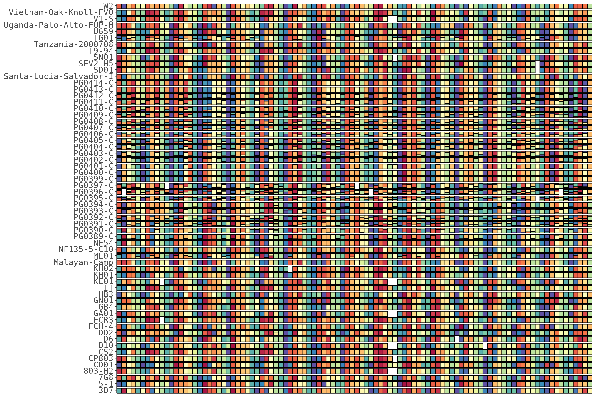
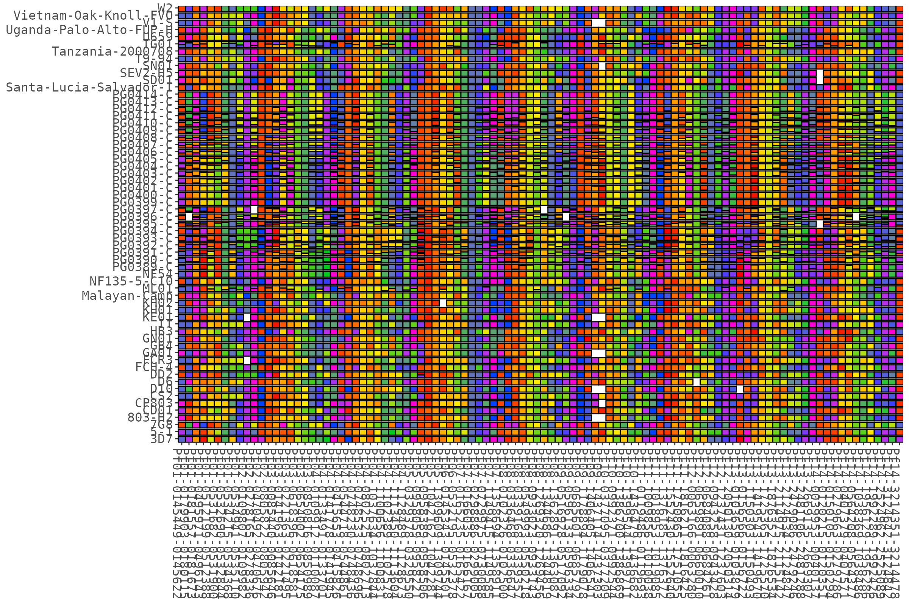
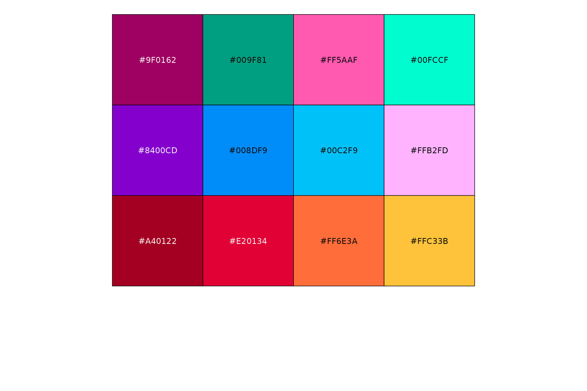
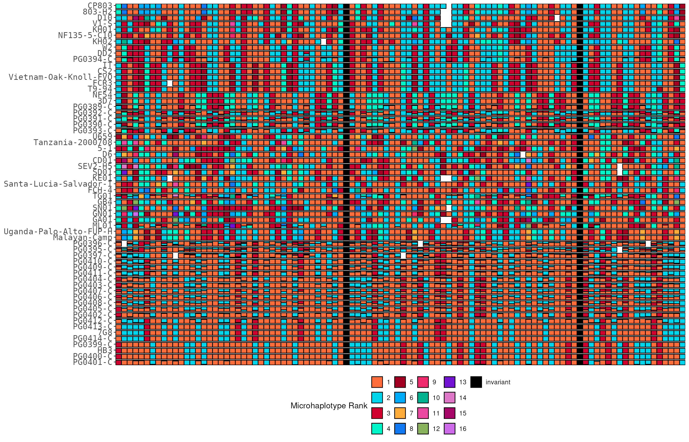
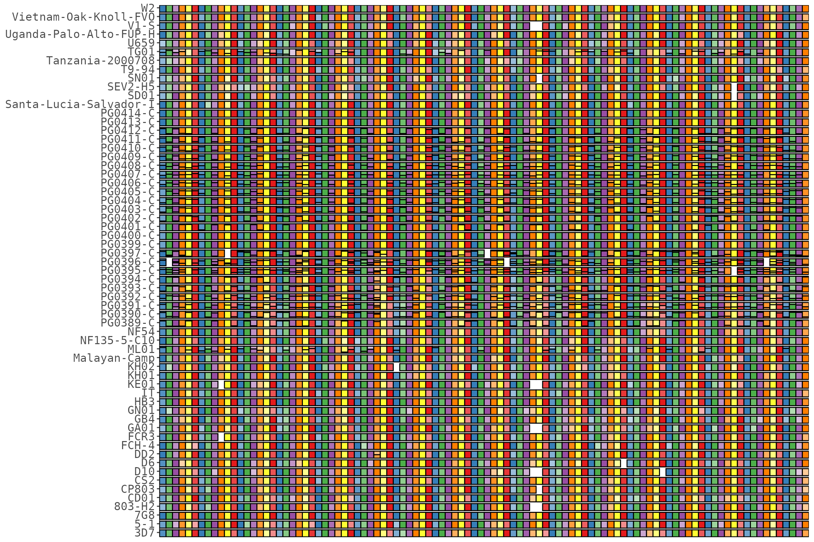
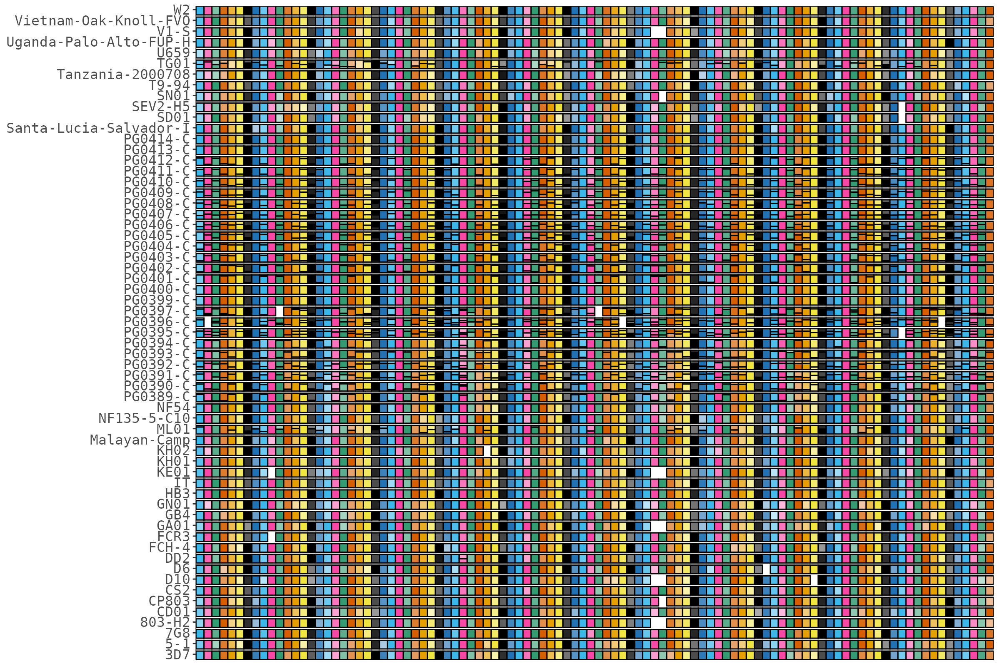

# Colours & plot styles

This article covers the ways to colour a rainbow plot: the rotating
gradient and its period, custom ramps, the shipped colour-blind
palettes, discrete **rank** colours (the “boring” fixed-colour mode),
and **shade** plots.

``` r

library(HaplotypeRainbows)
library(ggplot2)

data("pfisolateExample")
rb <- HaplotypeRainbow$new(
  pfIsosHeomeV1,
  sample_col    = "s_Sample",
  target_col    = "p_name",
  popuid_col    = "h_popUID",
  rel_abund_col = "c_AveragedFrac"
)
rb$prep(sort = "population_rank")
```

## The rainbow gradient

By default the dominant haplotype’s hue rotates across targets with a
**period** (`color_period`, default 11), which is what produces the
“rainbow”. A shorter period cycles the colours faster:

``` r

rb$prep(sort = "population_rank", color_period = 6)
rb$plot(x_axis_labels = FALSE)
```



Supply your own ramp with `colors` (its length should match
`color_period`):

``` r

rb$plot(colors = c("#F50300", "#FF6E00", "#FFEB01", "#00CA1E", "#0241FE", "#FE00D4"))
```



The fill can be driven by either colour column from the prep —
log-spaced (default) or linear hue:

``` r

rb$plot(color_col = "popidFracLogColor")   # default (log-spaced hue)
rb$plot(color_col = "popidFracRegColor")   # linear hue
```

## Colour-blind-friendly palettes

The package ships three categorical palettes (`colorPalette_08`,
`colorPalette_12`, `colorPalette_15`) used by the metadata sidebars and
available for your own use:

``` r

scales::show_col(colorPalette_12)
```



## Discrete rank colours (the “boring” plot)

`plot(rank_colors = TRUE)` colours haplotypes by a discrete **rank**
with a legend, so the most abundant haplotype (rank 1) is the *same*
colour in every target — a flat, easy-to-read alternative to the
gradient.

When there are more ranks than palette colours, a ramp is interpolated
from the palette (dropping white/black, ordering by hue, then reordering
so consecutive ranks stay distinct — the abundant ranks 1, 2, 3 won’t
come out near-identical). Prep with `mark_invariant = TRUE` to give
single-haplotype (invariant) targets their own colour (black by
default).

``` r

rb$prep(sort = "population_rank", mark_invariant = TRUE)$sort_by_clustering()
rb$plot(rank_colors = TRUE, x_axis_labels = FALSE)
```



`get_rank_colors()` returns the rank -\> colour map (e.g. to reuse
elsewhere); pass a different `rank_palette` to
[`plot()`](https://rdrr.io/r/graphics/plot.default.html) /
`get_rank_colors()` to change it:

``` r

head(rb$get_rank_colors(), 5)
#>         1         2         3         4         5 
#> "#FF6E3A" "#00D5EB" "#D1012F" "#00F5C9" "#A40122"
```

## Shade plots

Instead of a rotating rainbow, `prep_shade()` colours each target with
**shades** of a per-target base colour.
[`plot()`](https://rdrr.io/r/graphics/plot.default.html) then uses the
shade colours automatically:

``` r

rb$prep_shade(min_pop_size = 1)
rb$plot(x_axis_labels = FALSE)
```



Pass your own base colours (each target cycles through these, then
shades within):

``` r

rb$prep_shade(base_colors = colorPalette_08)
rb$plot(x_axis_labels = FALSE)
```


