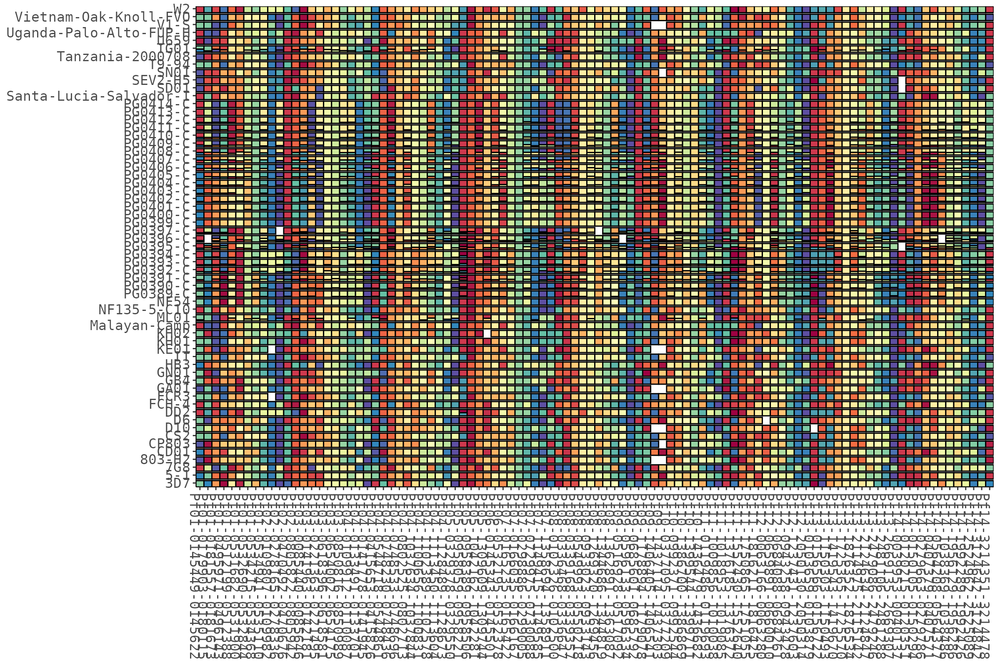
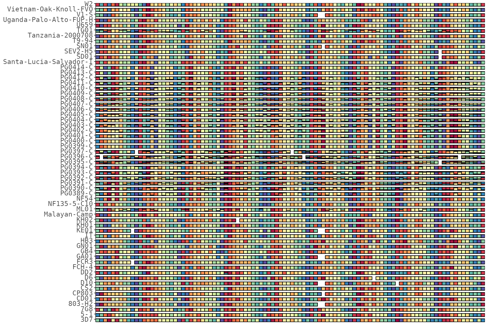
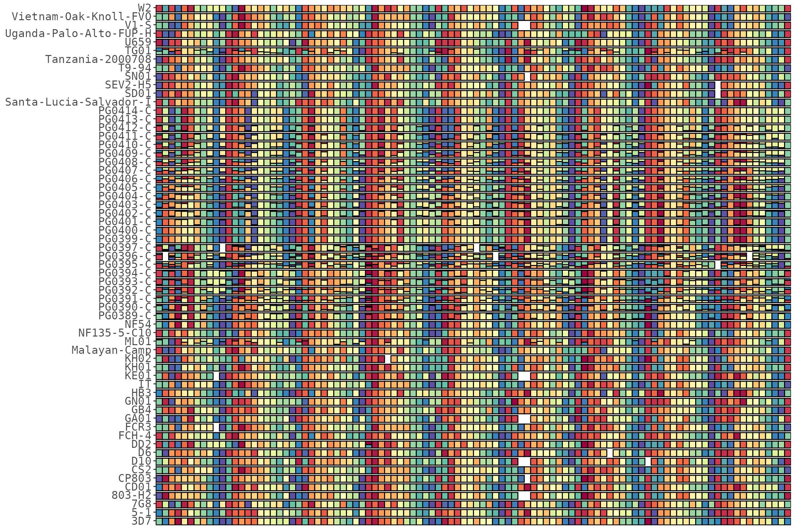
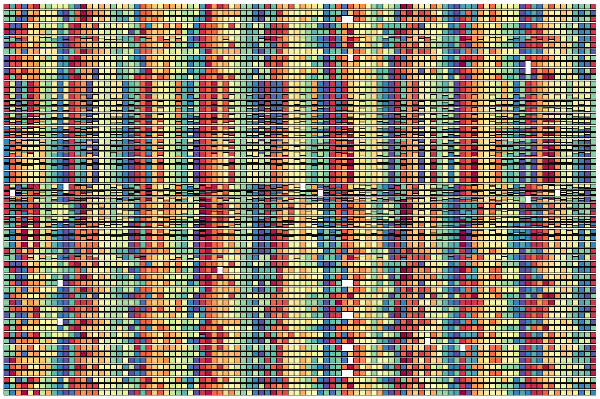

# Getting started

HaplotypeRainbows builds haplotype **“rainbow”** plots from
targeted-amplicon (microhaplotype) data: a grid where **columns are
targets** and **rows are samples**, and each cell shows the
within-sample haplotype composition. Haplotype colours rotate across
targets to produce the characteristic rainbow.

Everything hangs off one R6 class, `HaplotypeRainbow`, which carries
your column mapping so you only set it once. This article covers the
essentials; the other articles go deep on
[colours](https://nickjhathaway.github.io/HaplotypeRainbows/articles/colours.md),
[metadata](https://nickjhathaway.github.io/HaplotypeRainbows/articles/metadata.md),
[clustering &
splitting](https://nickjhathaway.github.io/HaplotypeRainbows/articles/clustering.md),
and [saving &
interactivity](https://nickjhathaway.github.io/HaplotypeRainbows/articles/saving.md).

``` r

library(HaplotypeRainbows)
library(ggplot2)

# example data (uses the older SeekDeep column names)
data("pfisolateExample")
```

## Constructing the object

You need four columns: a **sample** id, a **target** id, a within-target
**haplotype** id, and a **relative count** (raw counts are fine —
they’re normalised to within-sample fractions internally). The defaults
follow the Portable Microhaplotype Object (PMO) convention
(`library_sample_name` / `target_name` / `seq` / `reads`); the example
data uses the older SeekDeep names, so we pass them explicitly.

``` r

rb <- HaplotypeRainbow$new(
  pfIsosHeomeV1,
  sample_col    = "s_Sample",
  target_col    = "p_name",
  popuid_col    = "h_popUID",
  rel_abund_col = "c_AveragedFrac"
)
rb
#> <HaplotypeRainbow>
#>   columns: sample = s_Sample | target = p_name | haplotype = h_popUID | counts = c_AveragedFrac 
#>   rows in: 7611 
#>   prepped: <not yet - call $prep()>
```

[`haplotype_rainbow()`](https://nickjhathaway.github.io/HaplotypeRainbows/reference/haplotype_rainbow.md)
is an identical convenience constructor for PMO-named tables:

``` r

rb <- haplotype_rainbow(my_pmo_allele_table)   # PMO column names, no mapping needed
```

**Chaining.** Transforming methods (`prep()`, `prep_shade()`,
`sort_*()`, `set_sample_order()`, `add_cluster_gaps()`) mutate the
object and return it invisibly, so they chain.
[`plot()`](https://rdrr.io/r/graphics/plot.default.html) and the
`add_*()` helpers return a ggplot.

``` r

rb$prep(sort = "population_rank")$sort_by_clustering()$plot()
```

## Prepping: haplotype ordering

`prep()` must be called before plotting. `sort` controls how haplotypes
stack within each cell:

``` r

rb$prep(sort = "population_rank")   # order by population rank (default)
rb$plot()
```


``` r

rb$prep(sort = "within_sample_freq")   # order by within-sample fraction
rb$plot()
```



Other `prep()` knobs — `min_pop_size` drops sparse targets,
`color_period` sets the rainbow period (see the [colours
article](https://nickjhathaway.github.io/HaplotypeRainbows/articles/colours.md)),
and `bar_height < 1` leaves a gap between sample rows:

``` r

rb$prep(sort = "population_rank", bar_height = 0.6)   # thinner bars, more row gap
rb$plot(x_axis_labels = FALSE)
```



## Axis labels

Target names (x) and sample names (y) show by default. Toggle either off
— the plot keeps tight margins with no leftover ticks, which is handy
when there are too many samples or targets to label:

``` r

rb$prep(sort = "population_rank")
rb$plot(x_axis_labels = FALSE)                        # hide target names
```



``` r

rb$plot(x_axis_labels = FALSE, y_axis_labels = FALSE) # hide both
```



## Accessing the prepped data

`get_prepped()` returns the prepped table if you want to post-process
the plot yourself or inspect the derived columns:

``` r

head(rb$get_prepped())
#> # A tibble: 6 × 22
#>   s_Sample p_name       h_popUID c_AveragedFrac totalAbund s_COI relAbundCol_mod
#>   <fct>    <fct>        <chr>             <dbl>      <dbl> <int>           <dbl>
#> 1 3D7      Pf01-014544… Pf01-01…              1          1     1             0.8
#> 2 3D7      Pf01-017990… Pf01-01…              1          1     1             0.8
#> 3 3D7      Pf01-018155… Pf01-01…              1          1     1             0.8
#> 4 3D7      Pf01-049597… Pf01-04…              1          1     1             0.8
#> 5 3D7      Pf01-051219… Pf01-05…              1          1     1             0.8
#> 6 3D7      Pf01-053168… Pf01-05…              1          1     1             0.8
#> # ℹ 15 more variables: fracCumSum <dbl>, fracModCumSum <dbl>, fakeFrac <dbl>,
#> #   fakeFracMod <dbl>, fakeFracCumSum <dbl>, fakeFracModCumSum <dbl>,
#> #   samp_n <int>, popid <int>, maxPopid <int>, popidFrac <dbl>, hueMod <dbl>,
#> #   popidPerc <dbl>, popidFracRegColor <dbl>, popidPercLog <dbl>,
#> #   popidFracLogColor <dbl>
```
